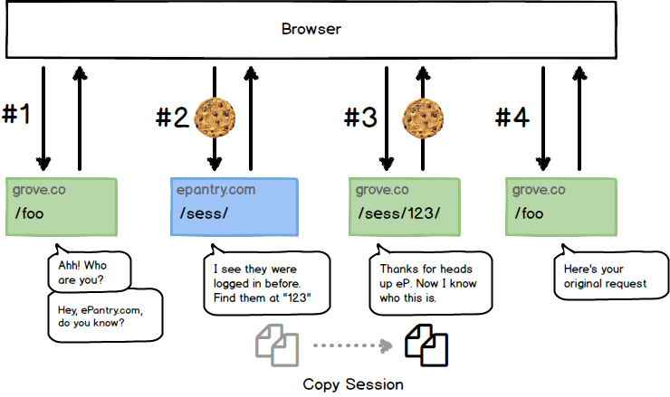

# Rebrand

Code extracted from rebranding Grove Collaborative (formerly ePantry). The code consists of four major parts:

- `RebrandMiddleware`: manages redirects of users before and after the rebrand
- `SessionExchangeMiddleware`: detects and redirects anonymous requests to original domain in order to copy the original session to the new domain
- `exchange_grant`: view that grants the new domain permission to copy the original session
- `handoff`: view that copies over the original session to the new domain

## Session Exchange

1. User Agent makes an anonymous request which SessionExchange detects and redirects to `epantry.com/session-exchange/`
2. User Agent sends cookie with request to ePantry.com which is used to identify the logged in user and creates a UUID token for their `request.session.session_key`. UA is redirected back to `grove.com/session-exchange/<token>`
3. grove.co can now copy the original session onto the current one
4. User Agent is redirected back to original requested URL as a logged in user
